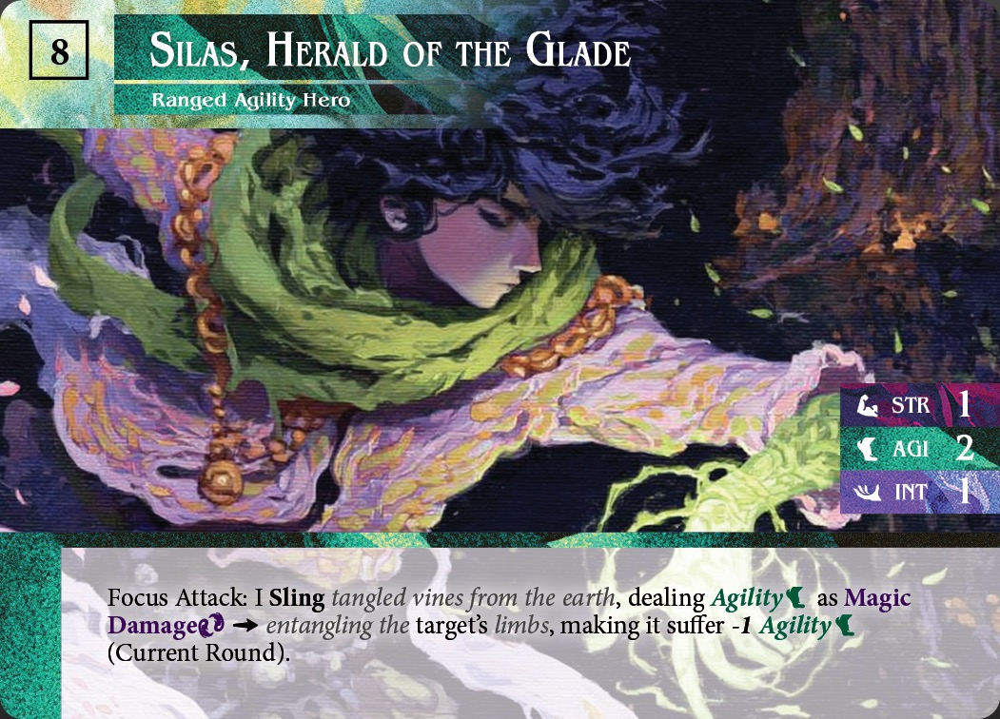
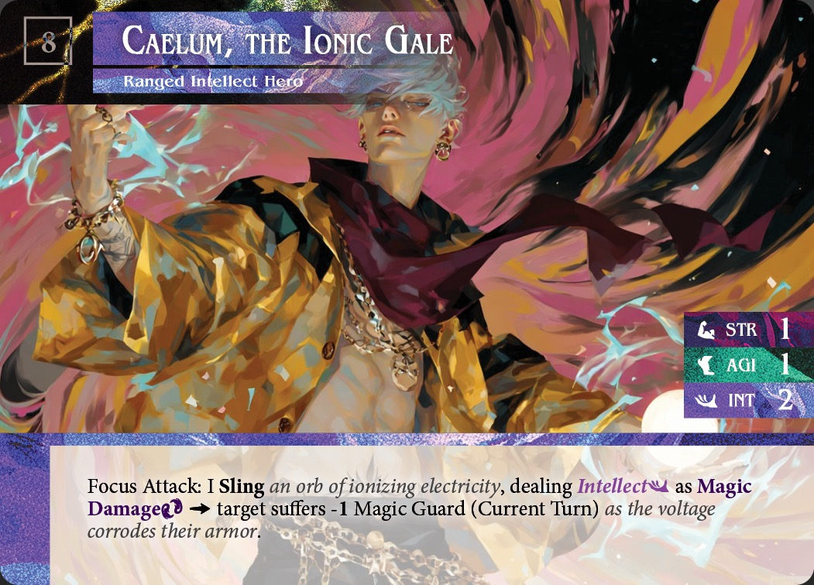
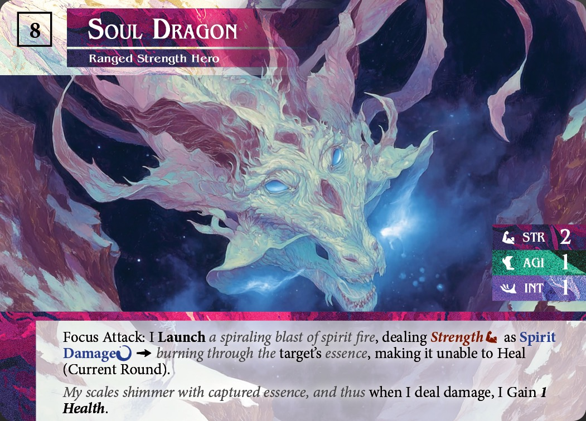
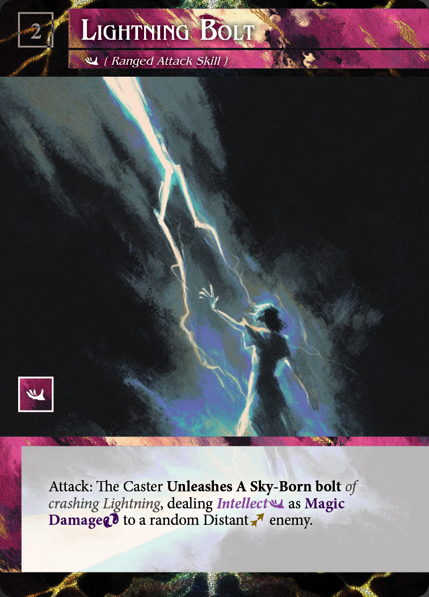
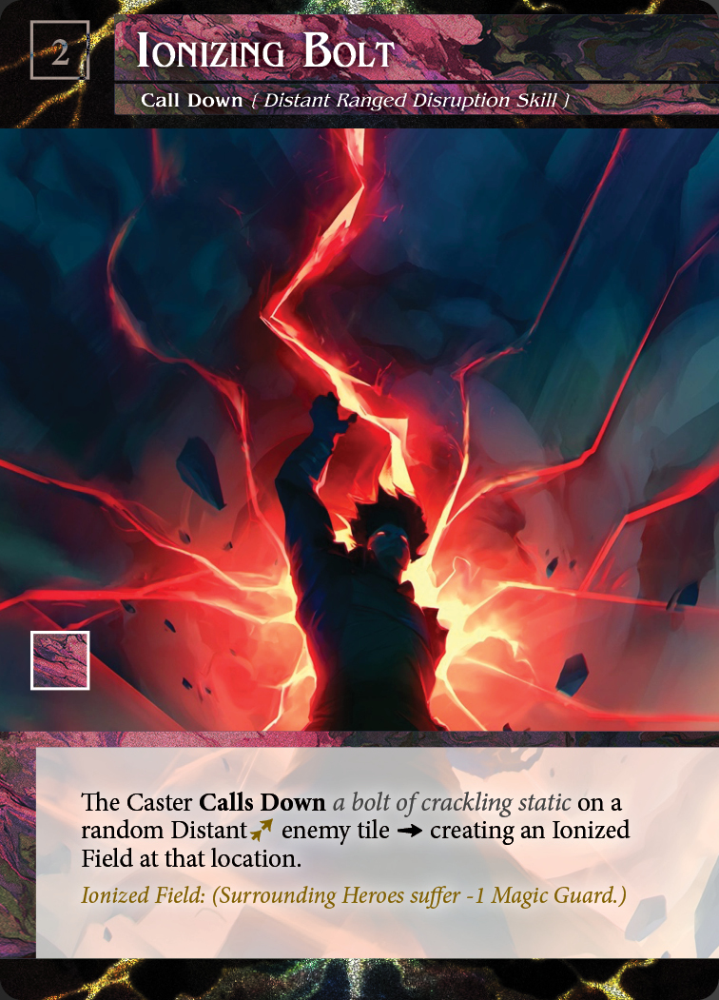
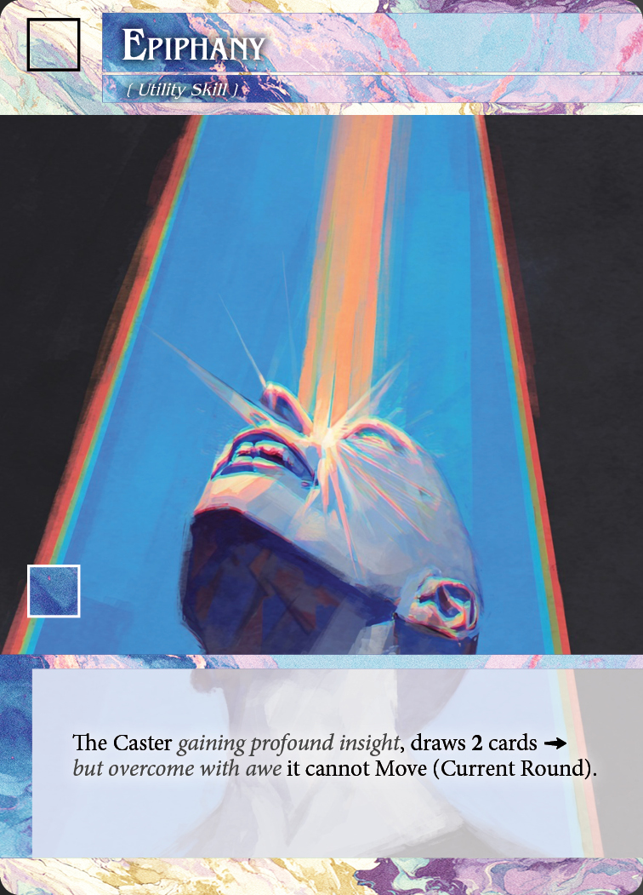
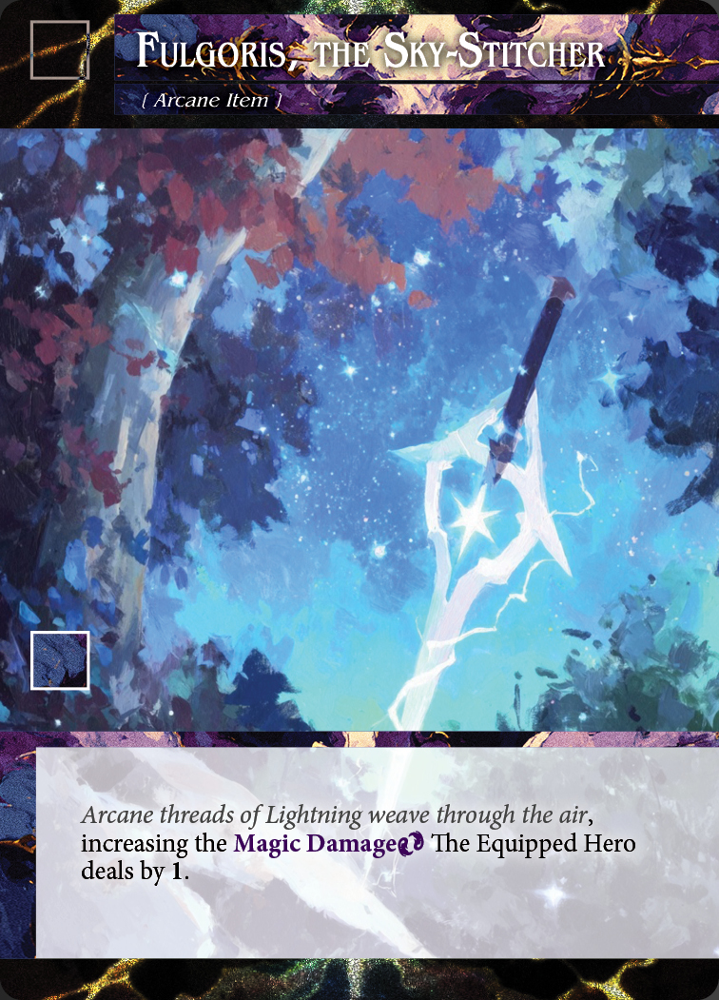
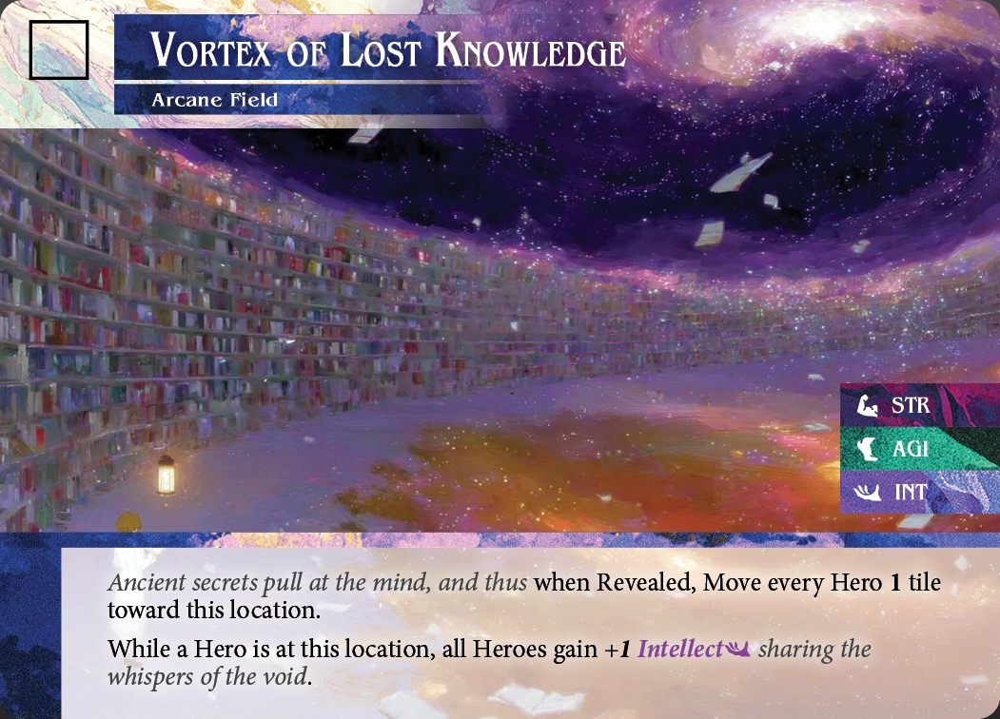

# 1. Card Anatomy

Use this section to identify what information is printed on cards before you begin setup or play.
Use this section to learn what belongs on a card and what you track away from the card.
Use later sections for the full procedure behind any printed value or instruction.

## 1.1 Hero Cards

A hero card identifies the hero and shows that hero's printed abilities.
Read a hero card from top to bottom.

_Example hero card_

_Example hero card_

_Example hero card_

1. Title: [[summary:title]]
This identifies the hero during setup and play.
2. Illustration: [[summary:illustration]]
3. Talents: [[summary:talent]]
A hero card may show one or more talents near the center of the card.
4. Printed hero stats: A hero card shows agility, intellect, strength, and max health in its stat area.
  - Agility: [[summary:agility]] Use §3.3 and §4.5 for the full rules.
  - Intellect: [[summary:intellect]] Use §§4.3 and 4.6 for the full rules.
  - Strength: [[summary:strength]] Use §5.4 for the full knockback rule.
  - Max Health: [[summary:max-health]] Use §§6.6 and 6.7 for damage and death. 
  - Use §§3 through 6 for the full rules behind those values.
5. Effect text: [[summary:effect-text]]
  - Innate attack: [[summary:innate-attack]] Use §4.6 for the full rule.

> **What This Means:** A hero card is both your identity reference and your base action reference. It shows who the hero is, which traits that hero has, and what that hero can always do without drawing a specific skill.

## 1.2 Skills

A skill tells you what a hero may play from hand during that hero's turn.
Read a skill from top to bottom.

_Example skill_

_Example skill_

_Example skill_

1. Title: [[summary:title]]
This identifies the skill when another rule or effect refers to it.
2. Talent: [[summary:talent]]
3. Attunement requirement: The numeric attunement requirement appears near the top of the card with the talent.
This tells you how much attunement that hero must have before you may play that skill.
4. Skill type: [[summary:skill-type]]
Every skill has 1 skill type.
  - Skill attack: [[summary:skill-attack]]
  - Disruption skill: [[summary:disruption-skill]]
  - Utility skill: [[summary:utility-skill]]
5. Focus and cost: Some skills show focus, a cost, or both near the rules text.
  - Focus: [[summary:focus]]
  - Cost: [[summary:cost]]
These tell you extra conditions or payments that apply before that skill resolves.
Resolve those checks and payments by following §§4.7 and 4.8.
6. Targeting and range instructions: Some skills show targeting or range instructions in the text box.
These tell you what that skill can affect and how far it can reach.
Use §4.7 and §5.5 for the current shared rules.
7. Effect text: [[summary:effect-text]]
This is the part of the card that creates the effect.
Resolve the skill by following §4.7 and the printed text.

> **What This Means:** A skill is a permission check followed by an instruction. This section helps you find the parts. Section 4 tells you when you may actually play the card and how its requirements are checked.

## 1.3 Arcane Item Cards

An arcane item card identifies one of the 4 objective pieces used to win the game.
Read this card as an objective marker first and as a reference card second.

_Example objective card_

1. Title: [[summary:title]]
Use the title to distinguish that objective card from the others.
2. Illustration: [[summary:illustration]]
3. Objective identity: The full card face tells you that this card is an arcane item rather than a skill or hero card.
Use that visual identity when the item is revealed, equipped, dropped, or checked against the win condition.

> **What This Means:** Arcane item cards matter because they mark objective progress. Their main job is to be easy to identify during movement, knockback, and win checks.

## 1.4 Arcane Field Cards

An arcane field card identifies the center objective tile.
Read this card as the final board objective.

_Example center objective card_

1. Title: [[summary:title]]
2. Illustration: [[summary:illustration]]
3. Objective identity: The full card face tells you that this card is the arcane field and not an arcane item.
Use that identity when you check the win condition from §0.1.

> **What This Means:** The arcane field card is the board's final destination marker. It tells you which tile must be occupied when your side has all 4 arcane items equipped.

## 1.5 Tracked Values

Some information is tracked during play instead of printed on cards.
Do not expect every game value to appear on a card face.

1. Attunement: Track each hero's attunement away from the card.
Use this value when you check whether that hero may play a skill.
2. Taken damage: Track each hero's taken damage away from the card.
Use this value when you check that hero's remaining health and death.
3. Death timer: Track each hero's death timer away from the card.
Use this value when you check whether that hero can return.
4. Hero state: Track whether each hero is deployed, ready, or dead.
Use these states when you check turn order, deployment, and return timing.
5. Wisdom (max hand size): Track each player's wisdom (max hand size) away from hero cards.
Wisdom (max hand size) is 3 by default.
Card effects may change that value.

> **What This Means:** Cards give you the printed baseline. Play also needs tracked values that change from turn to turn, so you must keep those values somewhere visible outside the card itself.
